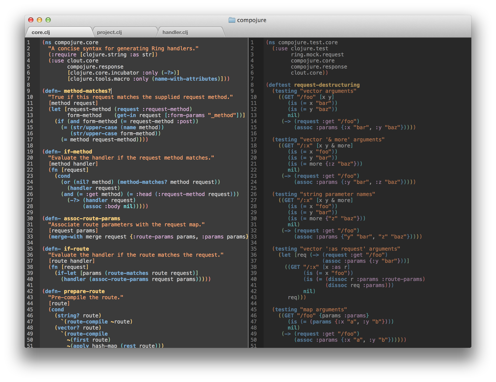

## Leviathan

*Clojure IDE for OS X*

* Current version: **0.1**
* Requires: OS X 10.9 and up
* Download: get [.zip file](https://raw.github.com/sdegutis/Leviathan/master/Builds/Leviathan-LATEST.app.tar.gz), unzip, right-click app, choose "Open"

#### Elevator pitch

Leviathan aims to be to Clojure what Xcode is to ObjC and IntelliJ is to Java.

Some permanent project goals:

- Lightweight and fast
- Minimalist UI
- Favors keyboard shortcuts
- Highly Clojure-specific refactoring functions
- User-customizable refactoring functions
- Completely customizable key bindings

#### Free and Open Source

Leviathan was originally intended to be a commercial IDE. But together, we can make this an even higher quality app.

#### Screenshot (v 0.0)

#### License

> Released under MIT license.
>
> Copyright (c) 2013 Steven Degutis
>
> Permission is hereby granted, free of charge, to any person obtaining a copy
> of this software and associated documentation files (the "Software"), to deal
> in the Software without restriction, including without limitation the rights
> to use, copy, modify, merge, publish, distribute, sublicense, and/or sell
> copies of the Software, and to permit persons to whom the Software is
> furnished to do so, subject to the following conditions:
>
> The above copyright notice and this permission notice shall be included in
> all copies or substantial portions of the Software.
>
> THE SOFTWARE IS PROVIDED "AS IS", WITHOUT WARRANTY OF ANY KIND, EXPRESS OR
> IMPLIED, INCLUDING BUT NOT LIMITED TO THE WARRANTIES OF MERCHANTABILITY,
> FITNESS FOR A PARTICULAR PURPOSE AND NONINFRINGEMENT. IN NO EVENT SHALL THE
> AUTHORS OR COPYRIGHT HOLDERS BE LIABLE FOR ANY CLAIM, DAMAGES OR OTHER
> LIABILITY, WHETHER IN AN ACTION OF CONTRACT, TORT OR OTHERWISE, ARISING FROM,
> OUT OF OR IN CONNECTION WITH THE SOFTWARE OR THE USE OR OTHER DEALINGS IN
> THE SOFTWARE.
